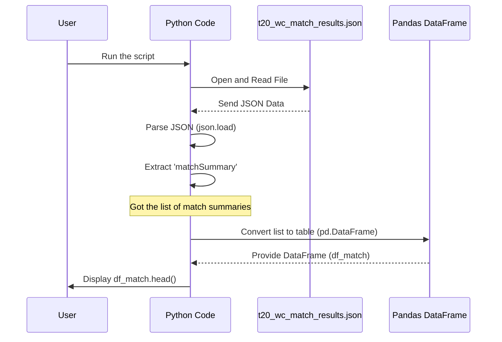

# Chapter 1: Match Summary Data

Welcome to the first chapter of our tutorial on understanding the data from the T20 World Cup 2022! In this chapter, we're going to start with a high-level view of the tournament: the summary of each match played.

### What is Match Summary Data?

Imagine you have a big list of all the T20 World Cup 2022 games. For each game, you just want the most important details – not every single ball bowled or run scored, but things like:

*   Which two teams played?
*   Who won the match?
*   By how much did they win (the "margin")?
*   Where was the match played (the "ground")?
*   When was the match played (the "date")?

This list, containing these key pieces of information for every match, is what we call the **Match Summary Data**. It's like getting a quick report card for the entire tournament, showing the results of every game at a glance.

### Why is this important?

Having this summary is super useful! If you just want to know who won which match, or how many games were played at a specific ground, or see the overall results table, the Match Summary Data is exactly what you need.

It's also the starting point for digging deeper. To understand *why* a team won, you first need to know *that* they won, which is in the summary. Later, we might use this summary to connect to more detailed data, like [Player Batting Statistics](03_player_batting_statistics_.md).

### Getting the Match Summary Data

In our project, this high-level match information is stored in a file. We'll use Python and a powerful tool called **pandas** (which helps work with data in tables) to read this data and see it clearly.

Let's look at the code used in the `T20 WC22.ipynb` notebook to load this data.

First, we need to import the necessary tools:

```python
import pandas as pd
import json
```
*   `pandas` (we'll call it `pd`) helps us work with data in a table format, which is perfect for match summaries.
*   `json` helps us read data stored in a format called JSON (JavaScript Object Notation), which is how our data is structured in the file.

Next, we open the file that contains the match results:

```python
with open('t20_wc_match_results.json') as f:
    data = json.load(f)
```
*   This code opens the file named `t20_wc_match_results.json`.
*   It then uses `json.load()` to read the content of the file and turn it into a Python object (like a list or dictionary), storing it in a variable called `data`.

Now, the important part: getting just the match summary information from the loaded data and putting it into a pandas DataFrame (a table):

```python
df_match = pd.DataFrame(data[0]['matchSummary'])
```
*   We know from looking at the structure of our `t20_wc_match_results.json` file (we'll see this more clearly later) that the match summary information is inside the first item of the main list (`data[0]`) and is stored under the key `'matchSummary'`.
*   `pd.DataFrame(...)` takes this `'matchSummary'` list and converts it into a nice, easy-to-work-with table called `df_match`.

Finally, let's look at the first few rows of our `df_match` table to see what it contains:

```python
df_match.head()
```

This code will show you the top records from the table, something like this:

```
         team1        team2       winner     margin   ground     matchDate  scorecard
0      Namibia    Sri Lanka      Namibia    55 runs  Geelong  Oct 16, 2022  T20I # 1823
1  Netherlands       U.A.E.  Netherlands  3 wickets  Geelong  Oct 16, 2022  T20I # 1825
2     Scotland  West Indies     Scotland    42 runs   Hobart  Oct 17, 2022  T20I # 1826
3      Ireland     Zimbabwe     Zimbabwe    31 runs   Hobart  Oct 17, 2022  T20I # 1828
4      Namibia  Netherlands  Netherlands  5 wickets  Geelong  Oct 18, 2022  T20I # 1830
```

See? It's a table! Each row is a match, and the columns tell us the `team1`, `team2`, `winner`, `margin`, `ground`, and `matchDate`. There's also a `scorecard` column, which contains a unique ID for the match (like "T20I # 1823"). This `scorecard` ID will be very important in the next chapter!

### How it Works (Under the Hood)

So, how did the computer get this table?

1.  **Data Storage:** The match summary information was saved in a file (`t20_wc_match_results.json`). This file uses JSON format, which organizes data using curly braces `{}` for objects (like dictionaries in Python) and square brackets `[]` for lists.
2.  **Reading the File:** Our Python code opens this file and reads its content.
3.  **Parsing JSON:** The `json.load()` function understands the JSON format and turns the text from the file into Python lists and dictionaries that our program can use.
4.  **Extracting the Summary:** We know the specific part of the Python data that holds the match summary list (`data[0]['matchSummary']`), so we grab that list.
5.  **Creating the Table:** The `pd.DataFrame()` function takes this list of match summaries and arranges it neatly into rows and columns, creating the table-like structure we see and store in `df_match`.

Here's a simple way to visualize this process:



This shows the flow: the code reads the file, understands the data inside (JSON), picks out the part we want (match summary), and then uses pandas to make a nice table for us to see.

### Conclusion

In this first chapter, we learned about the **Match Summary Data** – a crucial overview of the T20 World Cup 2022 results. We saw how it provides key details like teams, winners, margins, locations, and dates for every match. We also walked through the basic Python code that loads this data from a JSON file and structures it into a convenient pandas DataFrame, ready for analysis.

Knowing the summary of each match is our first step in understanding the tournament data. But how do we connect this summary information to more detailed data, like the performance of individual players in each match? That's where the unique match IDs come in, which we briefly saw in the `scorecard` column.

In the next chapter, we will explore the concept of [Match ID Mapping](02_match_id_mapping_.md) and understand how these unique identifiers help us link different pieces of data together.

[Next Chapter: Match ID Mapping](02_match_id_mapping_.md)

---
