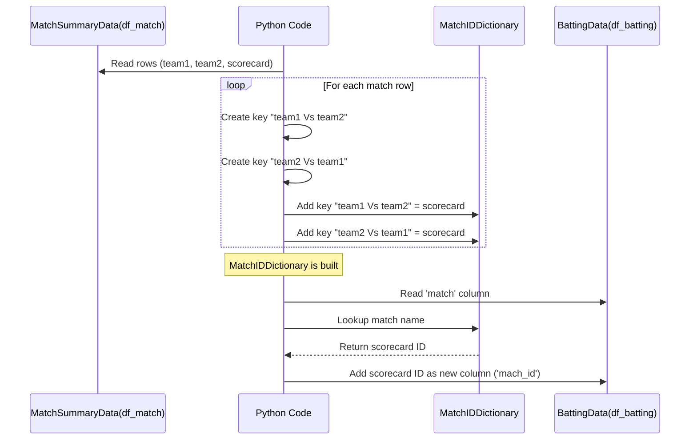

# Chapter 2: Match ID Mapping

Welcome back! In [Chapter 1: Match Summary Data](01_match_summary_data_.md), we got a bird's-eye view of the T20 World Cup 2022 tournament results. We saw how to load the basic match summary data, which told us who played, who won, and importantly, introduced us to a unique `scorecard` ID for each match, like "T20I # 1823".

Now, imagine you want to dive deeper. You have another set of data – maybe the detailed performance of every player in every match, showing how many runs they scored, balls faced, etc. This is what we'll look at in [Chapter 3: Player Batting Statistics](03_player_batting_statistics_.md).

### The Problem: Connecting Different Data Pieces

The challenge is, how do we link the player statistics back to a specific match in our summary data? The player stats might just list the match by name, like "India Vs Pakistan". But sometimes, the order of teams might be different ("Pakistan Vs India"), even though it's the *same* match! Also, our summary data uses a unique ID ("T20I # 1842" for the India vs Pakistan match).

We need a reliable way to say: "Okay, the player stats for 'India Vs Pakistan' (or 'Pakistan Vs India') belong to the match with ID 'T20I # 1842'."

### The Solution: Match ID Mapping

This is where **Match ID Mapping** comes in! It's simply a way to create a lookup list (like a dictionary in Python) that connects the *name* of a match (in different possible formats) to its unique `scorecard` ID.

Think of it like having an address book. You might have different ways to refer to the same person ("John Smith", "Johnny", "Mr. Smith"), but they all point to the same unique address. Our Match ID Map does the same for matches.

### Why is this important?

Having this map is crucial because different data files might use different ways to identify the same match. By creating a single, consistent map, we can easily link data from various sources using the unique match ID, even if the names don't match exactly (like "India Vs Pakistan" vs "Pakistan Vs India"). This allows us to combine the summary information (like who won) with the detailed player stats.

### Creating the Match ID Map

We can build this map using the `df_match` table we created in [Chapter 1](01_match_summary_data_.md), because it already contains both the team names (`team1`, `team2`) and the unique `scorecard` ID for each match.

We'll create a Python dictionary. The keys will be the match names (like "Team A Vs Team B" and "Team B Vs Team A"), and the values will be the corresponding `scorecard` ID.

Let's look at the code from the `T20 WC22.ipynb` notebook that does this:

```python
match_ids_dict = {}
# We already loaded df_match in the previous chapter
# from df_match we build the match_ids_dict
```

This code simply starts with an empty dictionary called `match_ids_dict`. This is where we will store our map.

Next, we go through each match in our `df_match` table and add two entries to our dictionary for each match: one for "team1 Vs team2" and one for "team2 Vs team1".

```python
for index, row in df_match.iterrows():
    key1= row['team1'] + ' Vs ' + row['team2']
    key2= row['team2'] + ' Vs ' + row['team1']

    match_ids_dict[key1]= row["scorecard"]
    match_ids_dict[key2]= row["scorecard"]
```

Let's break this down:

*   `for index, row in df_match.iterrows():` This line tells Python to go through each row in the `df_match` table one by one. In each turn of the loop, `row` will contain the data for a single match.
*   `key1 = row['team1'] + ' Vs ' + row['team2']`: This creates the first version of the match name key using the teams in the order they appear in the `team1` and `team2` columns (e.g., "Namibia Vs Sri Lanka").
*   `key2 = row['team2'] + ' Vs ' + row['team1']`: This creates the second version of the match name key, swapping the order of the teams (e.g., "Sri Lanka Vs Namibia").
*   `match_ids_dict[key1] = row["scorecard"]`: This adds an entry to our dictionary where `key1` is the key, and the `scorecard` ID for that row is the value.
*   `match_ids_dict[key2] = row["scorecard"]`: This adds another entry to the dictionary where `key2` is the key, and it points to the *same* `scorecard` ID.

After the loop finishes, our `match_ids_dict` will contain an entry for every match, listed in both possible team orders, with each name pointing to the unique match ID.

If we print the dictionary (`match_ids_dict`), it will look something like this:

```python
match_ids_dict
```

```
{
'Namibia Vs Sri Lanka': 'T20I # 1823',
'Sri Lanka Vs Namibia': 'T20I # 1823',
'Netherlands Vs U.A.E.': 'T20I # 1825',
'U.A.E. Vs Netherlands': 'T20I # 1825',
'Scotland Vs West Indies': 'T20I # 1826',
'West Indies Vs Scotland': 'T20I # 1826',
# ... and so on for all matches
'India Vs Pakistan': 'T20I # 1842',
'Pakistan Vs India': 'T20I # 1842',
# ...
}
```

Notice how both 'India Vs Pakistan' and 'Pakistan Vs India' correctly map to 'T20I # 1842'. This is exactly what we need!

### Using the Match ID Map

Now that we have our `match_ids_dict`, we can use it to add the correct `scorecard` ID to other data tables that might only have the match name.

For instance, when we load the detailed batting statistics in the next chapter, the table will have a column called 'match' that contains names like "Namibia Vs Sri Lanka", "U.A.E. Vs Netherlands", etc.

Let's look at the first few rows of the `df_batting` table (which we will create in [Chapter 3](03_player_batting_statistics_.md), but imagine we have it now):

```python
# This code snippet is just to show how df_batting looks
# We will load df_batting in the next chapter
df_batting.head()
```

```
                  match teamInnings  battingPos             batsmanName  ...
0  Namibia Vs Sri Lanka     Namibia           1      Michael van Lingen  ...
1  Namibia Vs Sri Lanka     Namibia           2           Divan la Cock  ...
2  Namibia Vs Sri Lanka     Namibia           3  Jan Nicol Loftie-Eaton  ...
3  Namibia Vs Sri Lanka     Namibia           4           Stephan Baard  ...
4  Namibia Vs Sri Lanka     Namibia           5      Gerhard Erasmus(c)  ...
```

The 'match' column has names, but no unique ID. We can use our `match_ids_dict` to add a new column with the `scorecard` ID. Pandas DataFrames have a super useful function called `.map()` that is perfect for this.

```python
df_batting["mach_id"] = df_batting["match"].map(match_ids_dict)
```

*   `df_batting["match"]`: This selects the 'match' column from our `df_batting` table.
*   `.map(match_ids_dict)`: This tells pandas to go through each value in the 'match' column and look it up in our `match_ids_dict`. It will return the corresponding value (the `scorecard` ID) from the dictionary.
*   `df_batting["mach_id"] = ...`: This creates a new column in `df_batting` called 'mach\_id' and fills it with the looked-up `scorecard` IDs.

Now, if we look at the first few rows of `df_batting` again:

```python
df_batting.head()
```

```
                  match teamInnings  battingPos             batsmanName  ...      mach_id
0  Namibia Vs Sri Lanka     Namibia           1      Michael van Lingen  ...  T20I # 1823
1  Namibia Vs Sri Lanka     Namibia           2           Divan la Cock  ...  T20I # 1823
2  Namibia Vs Sri Lanka     Namibia           3  Jan Nicol Loftie-Eaton  ...  T20I # 1823
3  Namibia Vs Sri Lanka     Namibia           4           Stephan Baard  ...  T20I # 1823
4  Namibia Vs Sri Lanka     Namibia           5      Gerhard Erasmus(c)  ...  T20I # 1823
```

Success! We have added the unique `mach_id` column to our batting data, making it easy to link back to the match summary information.

### How it Works (Under the Hood)

Here's a simplified view of how creating and using the map works:



The Python code systematically reads the match summary, builds the dictionary with both name variations pointing to the same ID, and then uses that dictionary as a lookup tool to add the consistent ID to the batting data based on its potentially inconsistent match name column.

### Conclusion

In this chapter, we learned about **Match ID Mapping** – creating a simple lookup tool (a Python dictionary) that connects the name of a match, regardless of team order, to its unique identification number (`scorecard`). This map is essential for bringing together different pieces of data about the tournament. We saw how to build this map using the match summary data from the previous chapter and how to use it to add the crucial unique identifier to other datasets like player statistics.

With this mapping in place, we are now ready to explore the detailed performance data of individual players in the tournament, knowing we can always link it back to the specific match it came from.

[Next Chapter: Player Batting Statistics](03_player_batting_statistics_.md)

---
