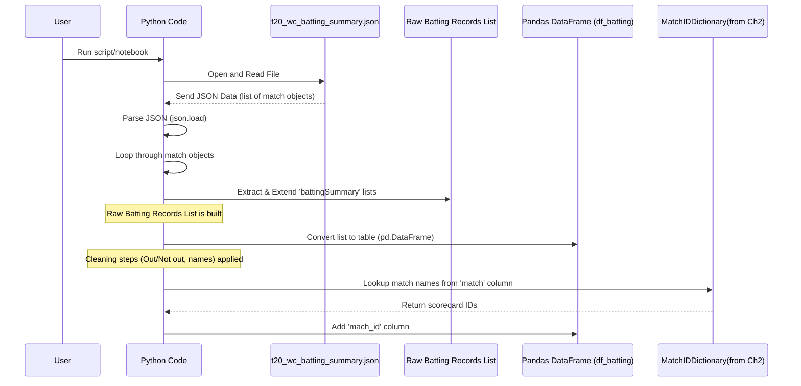

# Chapter 3: Player Batting Statistics

Welcome back, cricket data explorers! In our previous chapters, we started with the big picture: [Chapter 1: Match Summary Data](01_match_summary_data_.md) gave us the results for every match. Then, [Chapter 2: Match ID Mapping](02_match_id_mapping_.md) showed us how to create a special lookup tool (a dictionary) to uniquely identify each match using a `scorecard` ID, making it easy to connect data from different sources.

Now, let's zoom in from the match level to the player level. We want to see how individual players performed with the bat in each game they played. This is where **Player Batting Statistics** come in.

### What are Player Batting Statistics?

Imagine you are watching a match, and a batsman comes out to bat. You track how many runs they score, how many balls they face, how many fours and sixes they hit. You also note if they got out and how, or if they finished without getting dismissed (not out).

**Player Batting Statistics** are simply a detailed record of these actions for *every* player, for *every* time they came out to bat in the tournament.

For each batting instance, this data typically includes:

*   Which **Match** it was (like "India Vs Pakistan").
*   Which **Team** the player was batting for in that specific innings.
*   Their **Batting Position** (order in the lineup).
*   The **Batsman's Name**.
*   How they were **Dismissed** (caught, bowled, not out, etc.).
*   The **Runs** they scored.
*   The **Balls** they faced.
*   The number of **4s** they hit.
*   The number of **6s** they hit.
*   Their **Strike Rate** (how quickly they scored runs per 100 balls).

### Why is this important?

Having this detailed data allows us to answer questions like:

*   Who scored the most runs in a specific match?
*   Which player hit the most sixes in the tournament?
*   What was a player's strike rate in a particular innings?
*   How many times was a player dismissed by being caught?

This granular data is the foundation for analyzing individual player performance and comparing players.

### Getting the Player Batting Statistics Data

Just like the match summary data, the player batting statistics are stored in a file, but this file is structured slightly differently. We'll use pandas and the `json` library again to load and organize this data.

The relevant code from the `T20 WC22.ipynb` notebook is below. We'll break it down.

First, make sure you have imported the necessary libraries (we did this in Chapter 1, but it's good practice to include imports at the start of a script or notebook):

```python
import pandas as pd
import json
```

Next, we load the data from the specific JSON file containing batting summaries:

```python
with open('t20_wc_batting_summary.json') as f:
    data = json.load(f)
```
*   This opens the file named `t20_wc_batting_summary.json`.
*   `json.load(f)` reads the content and turns it into a Python object stored in the `data` variable.

Now, the structure of this JSON is a bit different from the match summary. It's a *list*, and *each item* in that list contains the data for *one match*, including a sub-list specifically for the batting details of that match (`'battingSummary'`). We want to gather *all* the batting records from *all* the matches into one big list.

```python
all_records=[]
for rec in  data :
    all_records.extend(rec['battingSummary'])
```
*   We start with an empty list called `all_records`.
*   We loop through each `rec` (record) in the `data` list (each `rec` represents one match's full data).
*   Inside each `rec`, we access the list of batting records using `rec['battingSummary']`.
*   `all_records.extend(...)` adds all the items from that match's `battingSummary` list to our main `all_records` list.

After this loop, `all_records` is a single list containing every player's batting performance record from every match.

Finally, we convert this list of records into a pandas DataFrame:

```python
df_batting = pd.DataFrame(all_records)
```
*   `pd.DataFrame()` takes our `all_records` list and creates a structured table, which we store in the variable `df_batting`.

Let's peek at the first few rows of our new `df_batting` table:

```python
df_batting.head()
```

You'll see something like this:

```
                  match teamInnings  battingPos             batsmanName  ...
0  Namibia Vs Sri Lanka     Namibia           1      Michael van Lingen  ...
1  Namibia Vs Sri Lanka     Namibia           2           Divan la Cock  ...
2  Namibia Vs Sri Lanka     Namibia           3  Jan Nicol Loftie-Eaton  ...
4  Namibia Vs Sri Lanka     Namibia           5      Gerhard Erasmus(c)  ...
...
```
*(Note: The actual output might show slightly more rows, but this gives the idea.)*

This table now contains a row for each time a player batted in the tournament, along with their specific stats for that batting instance.

### Cleaning and Preparing the Data

Looking at the data, we might notice a couple of things we can improve for easier analysis:

1.  **Dismissal Status:** The `dismissal` column tells us how a player got out. If they were "Not out", this column is usually empty. It would be helpful to have a separate column that simply says "Out" or "Not out".
2.  **Batsman Name Symbols:** Sometimes, symbols like `†` (dagger) are included in the `batsmanName` to indicate a wicket-keeper. We might want to remove these for cleaner names.

Let's add a column for "Out/Not out" based on the `dismissal` column:

```python
df_batting["Out/Not out"] = df_batting.dismissal.apply(lambda x: "Out" if len(x) > 0 else "Not out")
```
*   `df_batting.dismissal`: Selects the 'dismissal' column.
*   `.apply(...)`: This applies a small function (defined using `lambda`) to each item in the column.
*   `lambda x: "Out" if len(x) > 0 else "Not out"`: This is a quick way to write a function. For each value `x` in the 'dismissal' column, it checks if the *length* of the value is greater than 0 (meaning it's not an empty string). If it is, the function returns "Out"; otherwise (if it's empty), it returns "Not out".
*   `df_batting["Out/Not out"] = ...`: This creates a new column named 'Out/Not out' and fills it with the results of applying the function.

Now, let's clean up the batsman names:

```python
df_batting['batsmanName'] = df_batting['batsmanName'].apply(lambda x: x.replace('†', ''))
# We might also remove (c) for captain later, but let's start with †
```
*   `df_batting['batsmanName']`: Selects the 'batsmanName' column.
*   `.apply(...)`: Applies another function to each name.
*   `lambda x: x.replace('†', '')`: For each name `x`, this replaces any occurrence of the '†' symbol with an empty string, effectively removing it.
*   `df_batting['batsmanName'] = ...`: Updates the 'batsmanName' column with the cleaned names.

If we look at the data again (`df_batting.head()`), we'll see the new 'Out/Not out' column and potentially cleaner names.

### Linking with Match IDs

Remember the `match_ids_dict` we created in [Chapter 2](02_match_id_mapping_.md)? That dictionary maps match names (like "Namibia Vs Sri Lanka" or "Sri Lanka Vs Namibia") to their unique `scorecard` ID (like "T20I # 1823").

Our `df_batting` table has a 'match' column with names like "Namibia Vs Sri Lanka". To link this detailed batting data back to the match summary data (which uses the unique IDs), we need to add the `scorecard` ID to `df_batting`.

We can use the `.map()` function with our `match_ids_dict` for this:

```python
df_batting["mach_id"] = df_batting["match"].map(match_ids_dict)
```
*   `df_batting["match"]`: Selects the 'match' column from the batting data.
*   `.map(match_ids_dict)`: Uses the dictionary we created earlier to look up the `scorecard` ID for each match name in the 'match' column.
*   `df_batting["mach_id"] = ...`: Creates a new column called 'mach\_id' and fills it with the corresponding `scorecard` IDs.

Let's look at the head of `df_batting` one last time:

```python
df_batting.head()
```

```
                  match teamInnings  battingPos             batsmanName  ...      mach_id
0  Namibia Vs Sri Lanka     Namibia           1      Michael van Lingen  ...  T20I # 1823
1  Namibia Vs Sri Lanka     Namibia           2           Divan la Cock  ...  T20I # 1823
2  Namibia Vs Sri Lanka     Namibia           3  Jan Nicol Loftie-Eaton  ...  T20I # 1823
3  Namibia Vs Sri Lanka     Namibia           4           Stephan Baard  ...  T20I # 1823
4  Namibia Vs Sri Lanka     Namibia           5      Gerhard Erasmus(c)  ...  T20I # 1823
...
```
*(Note: The 'Out/Not out' column should also be visible here, but the example might be truncated.)*

Now, each row in `df_batting` not only tells us a player's stats for a specific batting instance but also includes the unique `mach_id` that links back to the overall match details in `df_match`. This is powerful for combining data!

### How it Works (Under the Hood)

Let's quickly visualize the process of loading and initially preparing the batting data:



The code reads the raw data, which is organized by match. It then flattens this structure by pulling out all the individual batting records and putting them into one long list. This list is then converted into a pandas table. Finally, using the map created in the previous chapter, it adds the unique match identifier to each row.

### Conclusion

In this chapter, we dove into the detailed **Player Batting Statistics** for the T20 World Cup 2022. We learned that this data provides a record of every single batting performance, including runs scored, balls faced, boundaries, and dismissal information. We saw how to load this data from a JSON file, handle its specific structure by combining records from all matches, and perform some basic cleaning (like determining 'Out/Not out' status and cleaning player names). Most importantly, we used the `match_ids_dict` created in [Chapter 2: Match ID Mapping](02_match_id_mapping_.md) to add a unique `mach_id` to our batting data, enabling us to link it back to the match summary information.

With the match summary data loaded and mapped, and the detailed batting data loaded, cleaned, and mapped, we have two valuable datasets ready for further work. In the next chapter, [Chapter 4: Data Transformation](04_data_transformation_.md), we will explore how to manipulate and reshape these tables to make them even more useful for analysis.

[Next Chapter: Data Transformation](04_data_transformation_.md)

---
