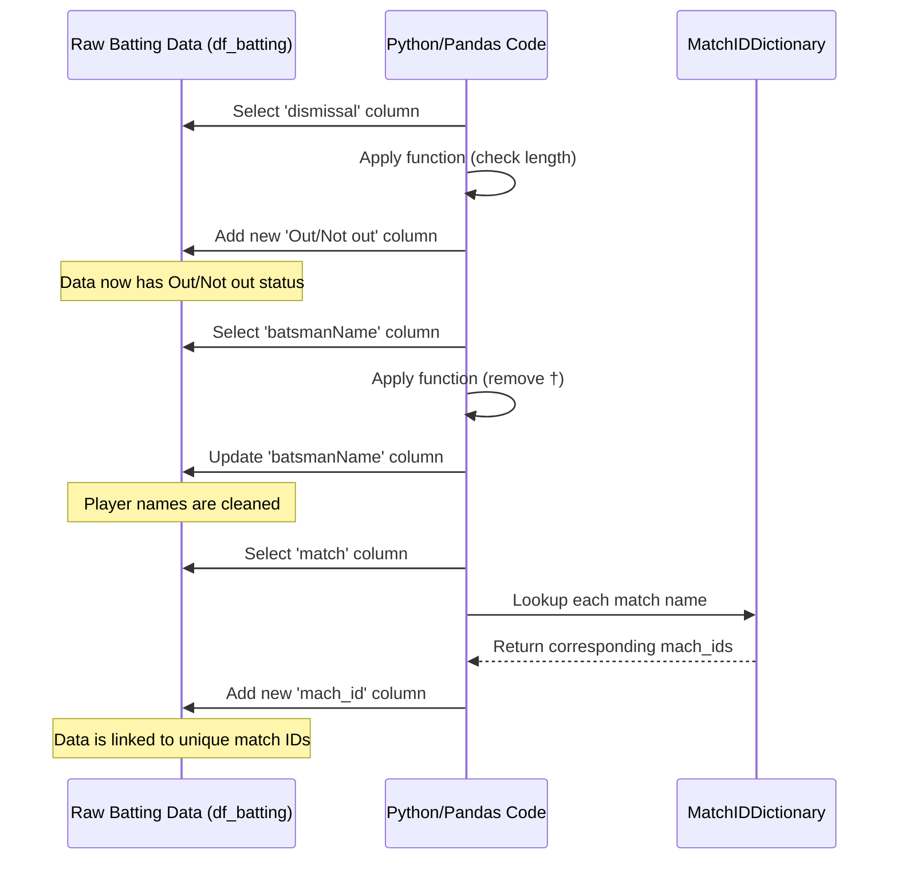

# Chapter 4: Data Transformation

Welcome back! In the previous chapters, we've gathered our raw materials: [Chapter 1: Match Summary Data](01_match_summary_data_.md) gave us the results overview (`df_match`), and [Chapter 3: Player Batting Statistics](03_player_batting_statistics_.md) provided the detailed performance of each player (`df_batting`). We also built a crucial tool in [Chapter 2: Match ID Mapping](02_match_id_mapping_.md) – the `match_ids_dict` – to link match names to unique IDs.

Now that we have our data loaded, we need to make sure it's in the best possible shape for analysis. Raw data often contains inconsistencies, extra symbols, or information spread across different columns that would be more useful if combined or simplified. This process of cleaning, structuring, and enriching data is called **Data Transformation**.

### What is Data Transformation?

Imagine you have a pile of ingredients before cooking a meal. Data transformation is like washing the vegetables, peeling the potatoes, chopping the onions, and mixing the spices. You're not creating *new* ingredients, but you're preparing the ones you have so they're ready to be used in your recipe (analysis).

In the context of our T20 World Cup data, **Data Transformation** means taking the loaded information, especially our detailed player batting stats (`df_batting`), and cleaning it up or adding useful new details to make it easier to analyze player performance.

It involves tasks like:

*   Standardizing information (e.g., making sure player names are consistent).
*   Creating new information based on existing data (e.g., figuring out if a player was 'Out' or 'Not out').
*   Adding context from other data sources (e.g., adding the unique match ID).

### Why is this important?

Clean and well-structured data is essential for accurate analysis. If player names have extra symbols, grouping stats by player becomes tricky. If dismissal information isn't clearly flagged, figuring out how many times a player was dismissed is harder. Adding the unique match ID allows us to easily combine batting stats with match results (like knowing who won the match a player played in).

Transforming the data upfront saves a lot of headaches later when you start asking complex questions about the data.

### Transforming our Player Batting Data

Let's look at some specific transformations we can apply to our `df_batting` table using the code from the `T20 WC22.ipynb` notebook.

Remember, we loaded `df_batting` in [Chapter 3](03_player_batting_statistics_.md). Its raw form looked something like this:

```
                  match teamInnings  battingPos             batsmanName  ...
0  Namibia Vs Sri Lanka     Namibia           1      Michael van Lingen  ...
1  Namibia Vs Sri Lanka     Namibia           2           Divan la Cock  ...
2  Namibia Vs Sri Lanka     Namibia           3  Jan Nicol Loftie-Eaton  ...
3  Namibia Vs Sri Lanka     Namibia           4           Stephan Baard  ...
4  Namibia Vs Sri Lanka     Namibia           5      Gerhard Erasmus(c)  ...
```

And it had a `dismissal` column that was either filled with how they got out, or empty if they were not out.

#### Transformation 1: Adding 'Out'/'Not out' Status

The `dismissal` column is great for detail, but often we just need to know if the player finished their innings or got out. This is a perfect opportunity to *transform* the data by creating a simpler flag.

We can create a new column, say 'Out/Not out', where we put "Out" if the `dismissal` column has *any* text in it, and "Not out" if it's empty.

Here's the code snippet (which we briefly saw in Chapter 3, now explained as a transformation):

```python
df_batting["Out/Not out"] = df_batting.dismissal.apply(lambda x: "Out" if len(x) > 0 else "Not out")
```

*   `df_batting.dismissal`: We select the 'dismissal' column.
*   `.apply(...)`: We tell pandas to go through each piece of text in the column and do something to it.
*   `lambda x: "Out" if len(x) > 0 else "Not out"`: This is a quick, simple function. For each piece of text `x`: if its length (`len(x)`) is more than 0 (meaning it's *not* empty), return "Out". Otherwise (if the length is 0, i.e., it's empty), return "Not out".
*   `df_batting["Out/Not out"] = ...`: We take the results of this transformation and store them in a brand new column called 'Out/Not out'.

After this step, our table now has an extra column clearly indicating the dismissal status for each batting entry. This transformed column is much easier to filter or count than inspecting the raw `dismissal` text.

#### Transformation 2: Cleaning Player Names

Player names might come with extra symbols. In our data, wicket-keepers are sometimes marked with a `†`. For analysis where we want to group all entries for a specific player, having these symbols can cause issues (e.g., "Kusal Mendis†" might be treated as a different player than "Kusal Mendis").

We need to *transform* these names to remove the unwanted symbols.

Here's the code to remove the `†` symbol (again, seen briefly in Chapter 3, now explained as a cleaning transformation):

```python
df_batting['batsmanName'] = df_batting['batsmanName'].apply(lambda x: x.replace('†', ''))
# We could also remove (c) for captain similarly if needed
```

*   `df_batting['batsmanName']`: We select the 'batsmanName' column.
*   `.apply(...)`: We apply a function to each name.
*   `lambda x: x.replace('†', '')`: For each name `x`, this replaces any occurrence of the '†' character with an empty string (`''`), effectively removing it.
*   `df_batting['batsmanName'] = ...`: We update the 'batsmanName' column with the cleaned names.

This transformation standardizes the player names, making it much easier to perform analysis like finding the total runs scored by a specific player across the tournament.

#### Transformation 3: Adding the Unique Match ID

In [Chapter 3](03_player_batting_statistics_.md), we loaded the batting data which had a 'match' column showing the match name (like "Namibia Vs Sri Lanka"). In [Chapter 2](02_match_id_mapping_.md), we created the `match_ids_dict` which maps these names (in both team orders) to a unique `scorecard` ID (like "T20I # 1823").

To link the batting data back to the match summary, we need to add this unique ID to our `df_batting` table. This is another form of data transformation – enriching the data by adding information from another source using a lookup.

We use the `.map()` function with our dictionary:

```python
# Assuming match_ids_dict was created in a previous cell/chapter
df_batting["mach_id"] = df_batting["match"].map(match_ids_dict)
```

*   `df_batting["match"]`: We select the 'match' column from our batting table.
*   `.map(match_ids_dict)`: This is the magical part! Pandas goes through each match name in the selected column and uses the `match_ids_dict` like a lookup table. For each match name it finds, it gets the corresponding `scorecard` ID from the dictionary.
*   `df_batting["mach_id"] = ...`: A new column called 'mach\_id' is created, and filled with the unique IDs looked up from the dictionary.

Now, every row in `df_batting` has the unique `mach_id`, allowing us to easily connect it to the `df_match` table (which also has the `scorecard` column, serving the same purpose). This linking is a key part of preparing data for combined analysis.

After these transformations, the head of `df_batting` would look like this (similar to the end of Chapter 3):

```python
df_batting.head()
```

```
                  match teamInnings  battingPos             batsmanName  ...  Out/Not out      mach_id
0  Namibia Vs Sri Lanka     Namibia           1      Michael van Lingen  ...          Out  T20I # 1823
1  Namibia Vs Sri Lanka     Namibia           2           Divan la Cock  ...          Out  T20I # 1823
2  Namibia Vs Sri Lanka     Namibia           3  Jan Nicol Loftie-Eaton  ...          Out  T20I # 1823
3  Namibia Vs Sri Lanka     Namibia           4           Stephan Baard  ...          Out  T20I # 1823
4  Namibia Vs Sri Lanka     Namibia           5      Gerhard Erasmus(c)  ...          Out  T20I # 1823
```

*(Note: The 'dismissal' column is still there, but the new 'Out/Not out' and 'mach\_id' columns, and the cleaned 'batsmanName', are now present.)*

Our `df_batting` table is now much cleaner and richer, ready for more advanced analysis!

### How it Works (Under the Hood)

Let's visualize how these transformations happen on the `df_batting` data:



Each transformation step takes the existing data, applies a rule or uses a lookup, and modifies the data (either by adding a new column or changing values in an existing one) to make it more useful for our goals.

### Conclusion

In this chapter, we focused on **Data Transformation** – the crucial step of cleaning and enhancing our raw data to make it analysis-ready. We revisited some steps from [Chapter 3: Player Batting Statistics](03_player_batting_statistics_.md), like adding the 'Out/Not out' flag and cleaning player names, framing them as essential transformations. We also saw how using the `match_ids_dict` from [Chapter 2: Match ID Mapping](02_match_id_mapping_.md) to add the unique `mach_id` to our batting data is a vital transformation for linking datasets.

By performing these transformations, our `df_batting` table is now standardized, clearer, and connected to the unique match identifiers, positioning it perfectly for deeper analysis. We have prepared the ingredients; now it's time to think about how we combine and structure data from different sources.

In the next chapter, [Chapter 5: JSON Data Loading](05_json_data_loading_.md), we'll look back at the initial step of loading data from JSON files, understanding the code used in Chapter 1 and 3 in more detail and seeing how the raw JSON structure relates to the pandas DataFrames we've been transforming.

[Next Chapter: JSON Data Loading](05_json_data_loading_.md)

---
