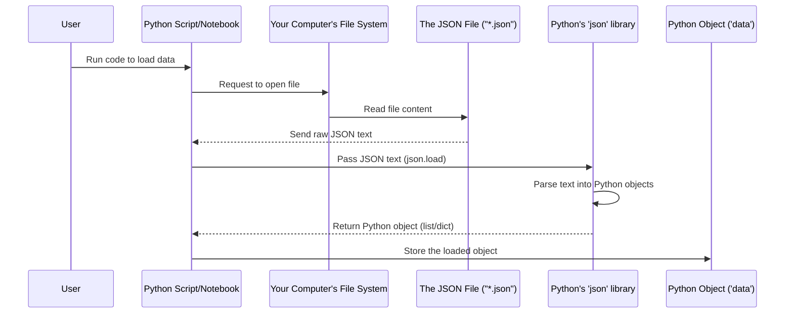

# Chapter 5: JSON Data Loading

Welcome to the final chapter of our beginner's tutorial on the T20 World Cup 2022 data! In the previous chapters, we've done quite a bit:
*   [Chapter 1: Match Summary Data](01_match_summary_data_.md) showed us the basic results table (`df_match`).
*   [Chapter 2: Match ID Mapping](02_match_id_mapping_.md) taught us how to create a dictionary (`match_ids_dict`) to link match names to unique IDs.
*   [Chapter 3: Player Batting Statistics](03_player_batting_statistics_.md) explored the detailed player performance data (`df_batting`).
*   [Chapter 4: Data Transformation](04_data_transformation_.md) covered how we cleaned and added useful columns to our data, especially `df_batting`, using the `match_ids_dict`.

But before we could do *any* of that analysis or transformation, we needed to get the data into our program in the first place! This fundamental first step is what this chapter is all about: **JSON Data Loading**.

### The Starting Point: Data Files

Imagine all the T20 World Cup 2022 data – who played, who won, every run scored, every ball bowled – is neatly saved in files on your computer. These files aren't like simple text documents; they're structured so that a computer program can easily read and understand them.

In our project, the raw data is stored in files using a popular format called **JSON**.

### What is JSON?

JSON stands for **JavaScript Object Notation**. Don't worry about the "JavaScript" part; you don't need to know JavaScript to understand JSON. For our purposes, think of JSON as a way to organize data using:

*   **Objects:** Like dictionaries in Python, they use curly braces `{}` and store data as `key: value` pairs (e.g., `"name": "Virat Kohli"`).
*   **Arrays:** Like lists in Python, they use square brackets `[]` and store a list of items (e.g., `["India", "Pakistan", "England"]`).
*   **Basic values:** Text (strings), numbers, true/false (booleans), or null (nothing).

It's a very common format for storing data because it's easy for both humans to read (it looks like organized text) and for computers to understand.

Our project uses two main JSON files:

1.  `t20_wc_match_results.json`: Contains the match summary information.
2.  `t20_wc_batting_summary.json`: Contains the detailed player batting statistics.

### The Goal: Get Data from File into Python

The core problem **JSON Data Loading** solves is taking the structured text inside these `.json` files and turning it into Python objects (like dictionaries and lists) that we can then easily work with, especially converting them into powerful pandas DataFrames (our tables).

### How to Load JSON Data in Python

Python has a built-in library specifically for working with JSON data. It's simply called `json`. We also use `pandas` because, as we saw in previous chapters, it's excellent for handling the tabular data once it's loaded.

```python
import pandas as pd
import json
```

This line imports the necessary tools. `pd` is just a shorter name we use for `pandas`.

#### Loading the Match Summary File (`t20_wc_match_results.json`)

Let's revisit the code from [Chapter 1: Match Summary Data](01_match_summary_data_.md) that loaded the match results:

```python
with open('t20_wc_match_results.json') as f:
    data = json.load(f)

# We then extracted a part and made a DataFrame:
# df_match = pd.DataFrame(data[0]['matchSummary'])
# df_match.head()
```

Let's break down the loading part:

1.  `with open('t20_wc_match_results.json') as f:`: This is the standard Python way to open a file. It opens the file named `t20_wc_match_results.json` for reading. The `with` statement is nice because it automatically closes the file when we're done, even if errors happen. The opened file is assigned to the variable `f`.
2.  `data = json.load(f)`: This is the key step! The `json.load()` function reads the *entire content* of the file `f` (which it expects to be valid JSON text) and **parses** it. Parsing means understanding the JSON structure (curly braces, square brackets, keys, values) and converting it into equivalent Python objects. The result of this conversion (typically a Python dictionary or list, depending on how the JSON file starts) is stored in the `data` variable.

After `data = json.load(f)` runs, the `data` variable in our Python program holds the information that was in the `t20_wc_match_results.json` file, but now as Python lists and dictionaries that we can work with directly.

*Self-Check:* If you were to print `data` right after loading, you'd see a complex structure of Python lists and dictionaries representing the JSON file's contents. Looking at this structure manually helps understand why we later access `data[0]['matchSummary']`.

#### Loading the Batting Summary File (`t20_wc_batting_summary.json`)

Now let's look at the code from [Chapter 3: Player Batting Statistics](03_player_batting_statistics_.md) that loaded the batting data:

```python
with open('t20_wc_batting_summary.json') as f:
    data = json.load(f)

# We then processed this data:
# all_records=[]
# for rec in  data :
#     all_records.extend(rec['battingSummary'])
# df_batting = pd.DataFrame(all_records)
# df_batting.head()
```

The loading part is identical:

1.  `with open('t20_wc_batting_summary.json') as f:`: Opens the batting summary file.
2.  `data = json.load(f)`: Reads the JSON content from the file and converts it into a Python object, storing it in the `data` variable.

Again, after this line, `data` contains the information from the JSON file as Python lists and dictionaries. The *structure* of the Python object might be different from the first file, reflecting the different structure of the JSON data within `t20_wc_batting_summary.json`. As we saw in Chapter 3, this file was a list of items, where each item held data for one match, including a `battingSummary` list inside it. This is why we needed the loop `for rec in data: all_records.extend(rec['battingSummary'])` to pull out all the individual batting records.

### How it Works (Under the Hood)

Let's simplify the loading process using a diagram. We'll focus on loading just one file, as the process is the same for both.



The user tells the Python script to load a file. The script asks the computer to open and read the file's content as raw text. This text is then given to Python's `json` library, which is specifically designed to understand the JSON language. The `json` library reads the curly braces, square brackets, keys, and values in the text and builds an equivalent structure using Python's built-in list and dictionary types. This resulting Python object is then stored in a variable (`data`) in your program, ready for you to access and manipulate.

### Connecting Loading to What Comes Next

Once the JSON data is loaded into Python objects (`data`), we can then:

1.  **Extract:** Pick the specific parts of the Python object we need (like `data[0]['matchSummary']` or `rec['battingSummary']`) because we understand the JSON structure.
2.  **Structure:** Convert these extracted parts into structured tables using pandas (`pd.DataFrame(...)`).
3.  **Map and Transform:** As shown in [Chapter 2](02_match_id_mapping_.md) and [Chapter 4](04_data_transformation_.md), we can then use these pandas DataFrames, create lookups like `match_ids_dict`, clean columns, and add new information, preparing the data for analysis.

So, the JSON data loading is the absolutely essential first step. Without successfully reading the data from the files and converting it into a format Python can understand, we wouldn't have any data to work with at all!

### Conclusion

In this chapter, we completed our journey through the data preparation steps by looking at the very beginning: **JSON Data Loading**. We learned that JSON is a structured text format for storing data and saw how Python's built-in `json` library, combined with the `with open()` statement, allows us to read the content of JSON files and convert it into usable Python lists and dictionaries. Understanding this loading process is fundamental, as it provides the raw material that we then transformed and analyzed in the preceding chapters.

This concludes our beginner's tutorial on loading and preparing the T20 World Cup 2022 data. You've learned how to get match summaries, handle unique match IDs, load detailed player statistics, and transform the data to make it ready for analysis. You now have a solid foundation to start exploring the data further and uncovering interesting insights about the tournament!

Congratulations on completing the tutorial!

---
