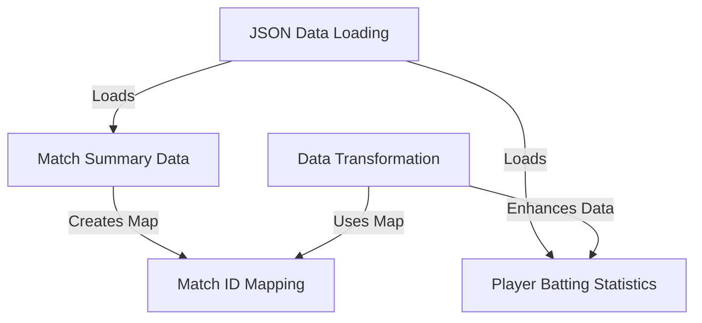

# Tutorial: T20-World-Cup-2022

This project loads and processes data from the T20 World Cup 2022.
It starts by loading **raw match summaries** and **detailed player batting statistics** from JSON files.
It then *transforms* the batting data by cleaning player names, determining dismissal types, and crucially, linking each batting record back to a specific match using a **match ID lookup map** generated from the summary data.

## Visual Overview

## Chapters

1. [Match Summary Data
](01_match_summary_data_.md)
2. [Match ID Mapping
](02_match_id_mapping_.md)
3. [Player Batting Statistics
](03_player_batting_statistics_.md)
4. [Data Transformation
](04_data_transformation_.md)
5. [JSON Data Loading
](05_json_data_loading_.md)

---
